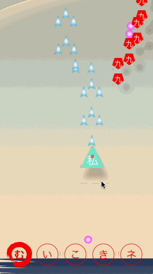
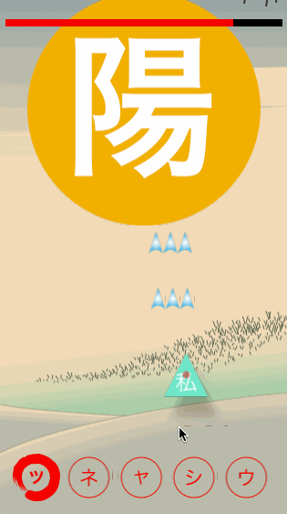

#  Jikoku

Jikoku is a shoot'em up game where you fight against kanjis!
Learn Japanese kanjis by blowing them to dust using your faithfull kanas.

When killing an enemy, one if its reading is displayed (hiraganas are printed in green and katanas in pink).

If the kana of your current weapon is included in one of the readings, it will deal double damages.

Jikoku is written in Swift and can be played on macOS and iOS.
